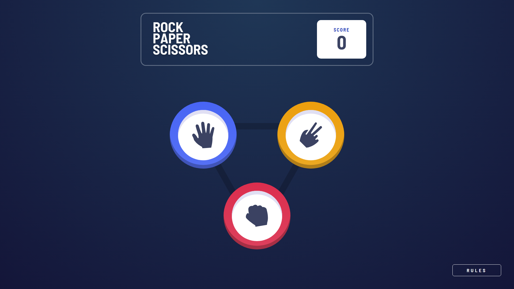
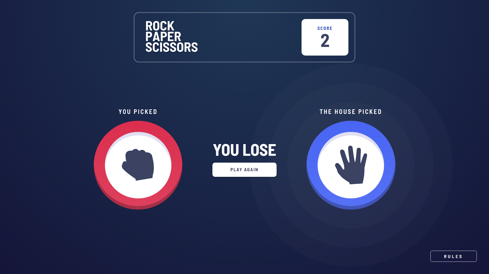
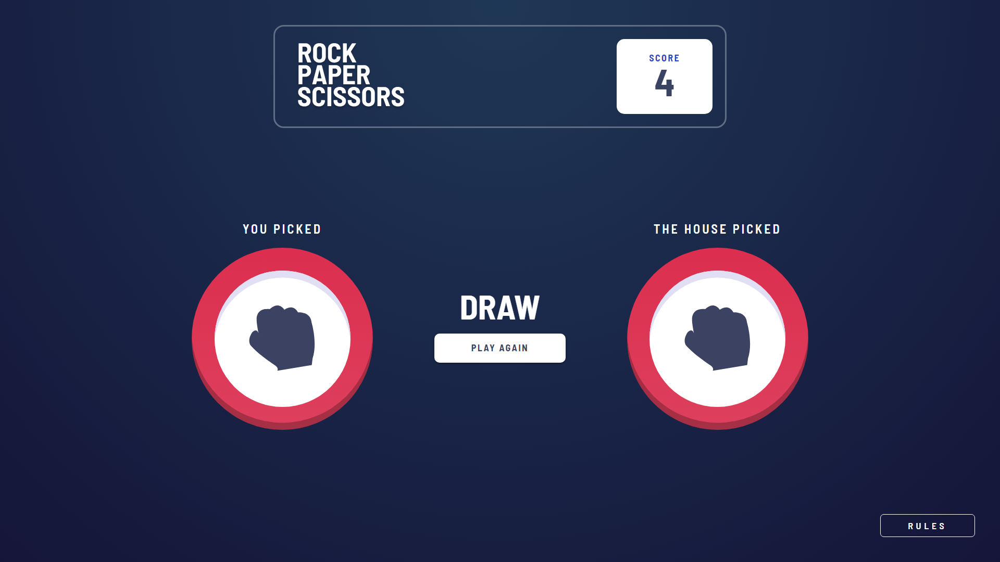
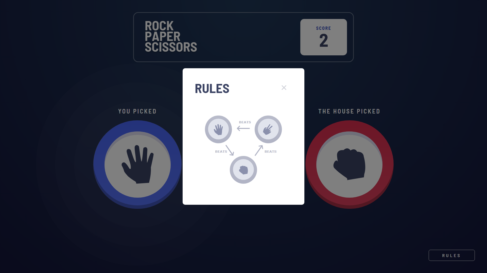
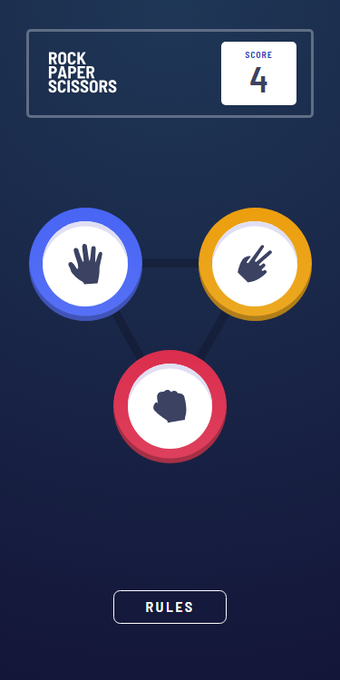
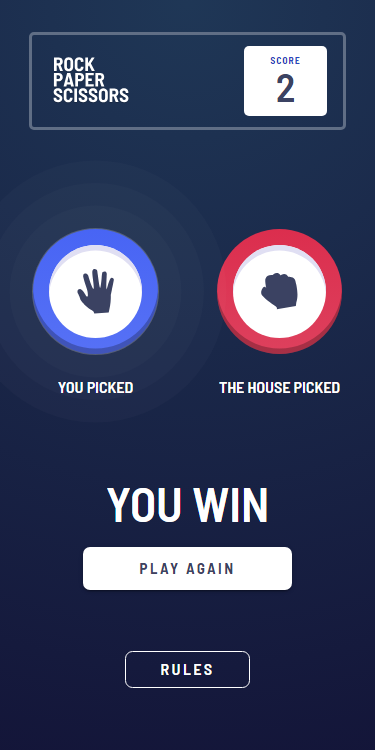
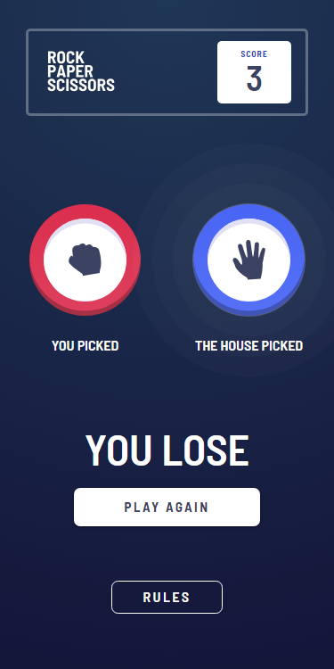
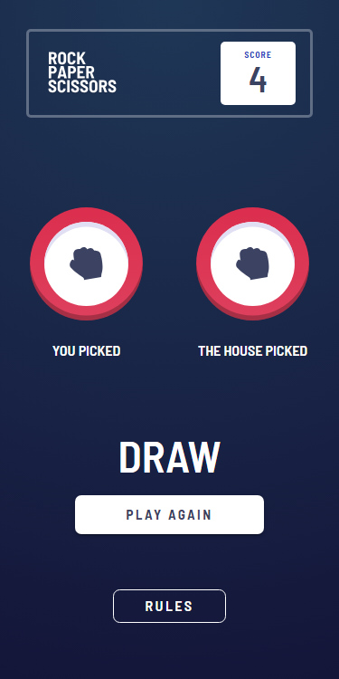
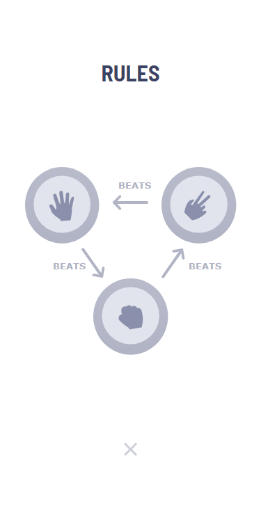

# Overview

This is a RPS (Rock-Paper-Scissors) game built with React, Redux-Tookit, and Material UI and the design specs were provided through Frontend Mentor.

## Screenshots

  
Desktop Screenshots

  
  
  
  
  

  
Mobile Screenshots

  
  
  
  
  

## Links

- [Solution (Frontend Mentor)](https://www.frontendmentor.io/solutions/rockpaperscissors-game-with-react-redux-and-material-ui-Jv1kwHBVE1)
- [Live Site](https://kmartwork.github.io/rock-paper-scissors/)

# My Process

I knew that this project was going to be fairly simple compared to some of the others that I've built in the past, so I spent some time trying to decide if it was overkill to be using Redux for this project.

Eventually, I decided that even though there was only one 'state slice' that I needed to deal with, it's easier for me to use Redux than have to deal with prop-drilling.

So, I created my state slice which would track things like score, player choice, cpu choice, and the winner of the round as well as some empty reducer functions that would be in charge of modifying those values.

Next, I began working on scaffolding out all the components I would need (e.g. the header, scorebox, options/icons, rules button, etc.) and slowly started piecing them all together to match the design specifications given to me. I started with the mobile version of the app first and once that was finished I moved on to the web version. 

All in all, there is always room for polish &/o improvement but I'm very happy with this as an MVP.

## Built With
- React
- Redux Toolkit
- Material UI
- SASS

## Author
Kawika Miller